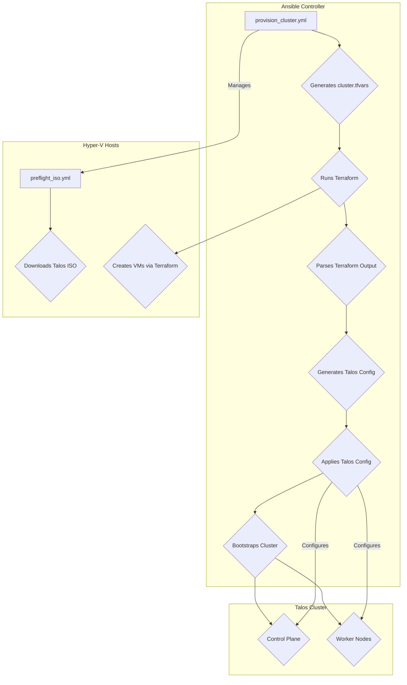

# IaC Provisioning Architecture

This document outlines the architecture and plan for provisioning the Talos cluster using Infrastructure as Code (IaC).

## Architecture Overview

The provisioning process is orchestrated by Ansible, which dynamically generates Terraform configurations to provision Hyper-V virtual machines and then configures them into a Talos cluster.

## Implementation Plan

1.  **Environment Setup**: Ensure Ansible and Terraform are installed and configured correctly.
2.  **Pre-flight Check**: Run the `preflight_iso.yml` playbook to download the Talos ISO on all Hyper-V hosts.
3.  **Cluster Provisioning**: Execute the `provision_cluster.yml` playbook to create the VMs and configure the Talos cluster.
4.  **Cluster Validation**: Verify that the cluster is running and that all nodes are healthy.
5.  **Documentation**: Update the `README.md` with instructions on how to use the IaC provisioning scripts.